# 🛺 RFID Rickshaw Management System

A three-part system that ties a **rickshaw**, its **owner**, and the **puller driving it right now** together using RFID cards — and exposes that live assignment to the public through a QR code on the rickshaw.

Anyone can scan the QR sticker on a rickshaw and instantly see **who is pulling it, which garage it belongs to, and who owns it** — verified live, not printed on paper.

<p align="center">
  
  
  
  
  
</p>

---

## 📑 Table of Contents

- [Why this project exists](#-why-this-project-exists)
- [How the system works](#-how-the-system-works)
- [Architecture](#-architecture)
- [The RFID scan flow](#-the-rfid-scan-flow)
- [Screenshots](#-screenshots)
- [Components](#-components)
- [Firebase data model](#-firebase-data-model)
- [Repository structure](#-repository-structure)
- [Getting started](#-getting-started)
- [Configuration](#-configuration)
- [Security](#-security)
- [Engineering notes](#-engineering-notes)
- [Troubleshooting](#-troubleshooting)
- [Roadmap](#-roadmap)
- [License](#-license)

---

## 🎯 Why this project exists

In most cities, a rickshaw owner rents the same vehicle to different pullers on different days. Nobody — not the passenger, not the garage, not the traffic authority — has a reliable way to answer a simple question:

> *"Who is driving this rickshaw right now, and is he supposed to be?"*

This system answers it with two RFID cards and a QR sticker:

| Card | Held by | Role |
|------|---------|------|
| 🔵 **Master RFID** | Rickshaw **owner** | Authorizes the assignment. Identifies which owner and which rickshaw. |
| 🟢 **Slave RFID** | Rickshaw **puller** | Identifies the driver being assigned to that rickshaw. |

Scan master → pick the rickshaw → scan slave → the rickshaw is now **ACTIVE** with that puller, everywhere, instantly.

---

## ⚙️ How the system works

```
1. ADMIN ENTERS DATA          2. OWNER ASSIGNS A PULLER       3. PUBLIC VERIFIES
   (Desktop App)                 (Desktop or Mobile App)         (QR code → web page)

   ┌──────────────┐              ┌──────────────┐                ┌──────────────┐
   │   Owners     │              │  Scan MASTER │                │  Scan the QR │
   │   Pullers    │   ──sync──▶  │      ↓       │   ──live──▶    │  on the      │
   │   Rickshaws  │              │  Pick        │                │  rickshaw    │
   │   RFID UIDs  │              │  rickshaw    │                │      ↓       │
   │   Photos     │              │      ↓       │                │  Name, photo │
   └──────────────┘              │  Scan SLAVE  │                │  ID, garage, │
                                 │      ↓       │                │  owner,      │
                                 │  ● ACTIVE    │                │  ● ACTIVE    │
                                 └──────────────┘                └──────────────┘
```

Everything moves through **Firebase Realtime Database**, so the desktop PC, the owner's phone, and the public web page always agree — even when a session is started from one device and ended from another.

---

## 🏗 Architecture

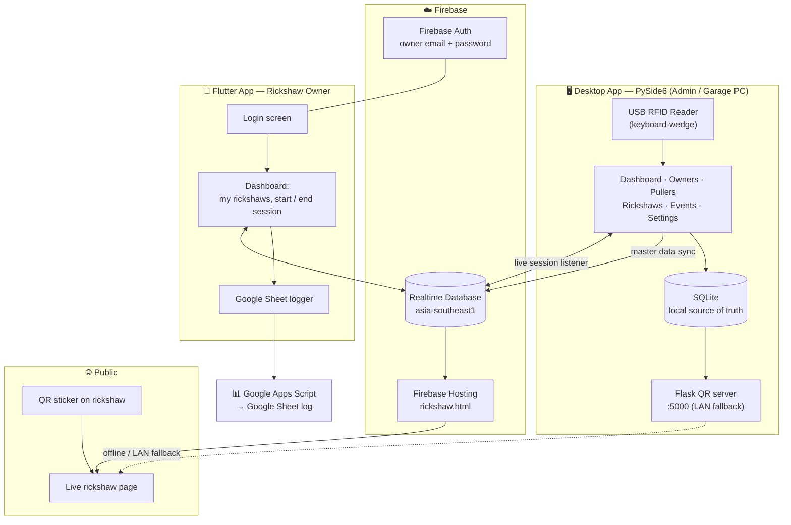

**One rule keeps the whole thing consistent:** a rickshaw can have **at most one active session at a time**, enforced by an atomic Realtime Database transaction on `live/active_sessions/{rickshawId}`. A phone and a PC can both try to start a session on the same rickshaw — exactly one wins, the other gets a clean conflict error.

---

## 🔄 The RFID scan flow

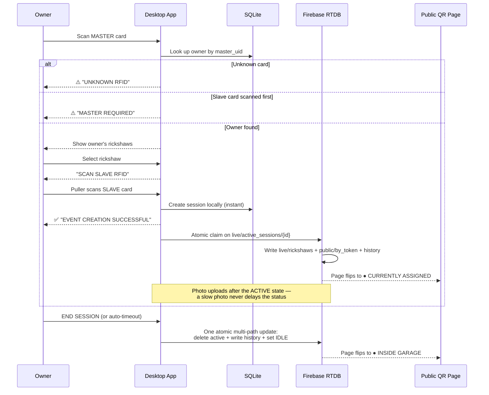

**States a rickshaw can be in:**

| State | Meaning | Public page shows |
|-------|---------|-------------------|
| `ACTIVE` | A puller is currently assigned | Puller photo, name, puller ID, start time, `● CURRENTLY ASSIGNED` |
| `IDLE` | No puller assigned | `● INSIDE GARAGE` |

Sessions end in four ways: the owner presses **END** on the desktop, the owner ends it from the **mobile app**, the **automatic timeout** expires (default 3600 s, configurable or disableable), or a newer session **supersedes** a stale one.

---

## 📸 Screenshots

> **Add your own images to `docs/screenshots/` using the file names below and they will appear here automatically.**

### 🖥️ Desktop App (PySide6)

| Dashboard — live RFID scanner | Owners |
|---|---|
| 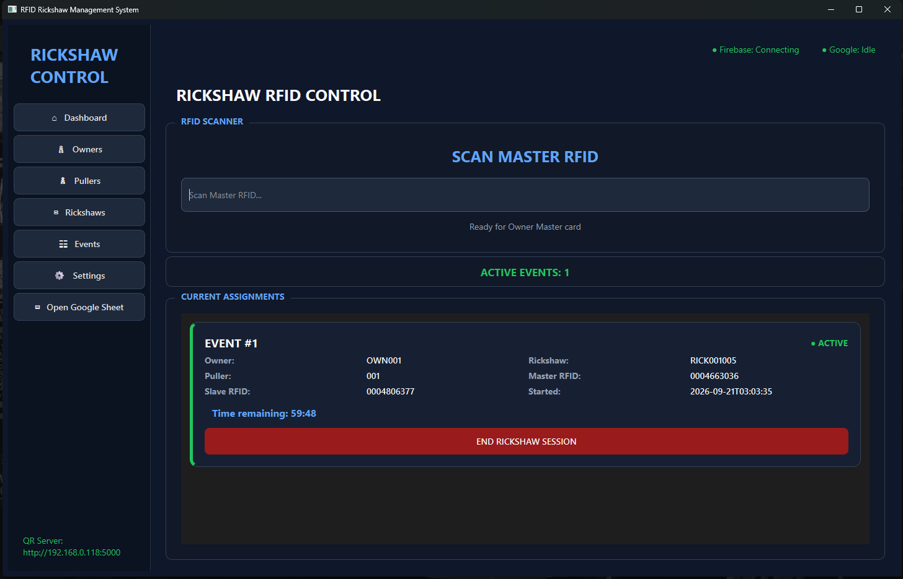 | 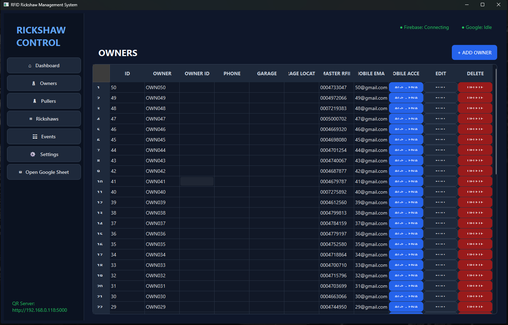 |
| Scan prompt, active event cards, countdown timers | Owner list with master RFID + mobile login control |

| Pullers | Rickshaws |
|---|---|
| 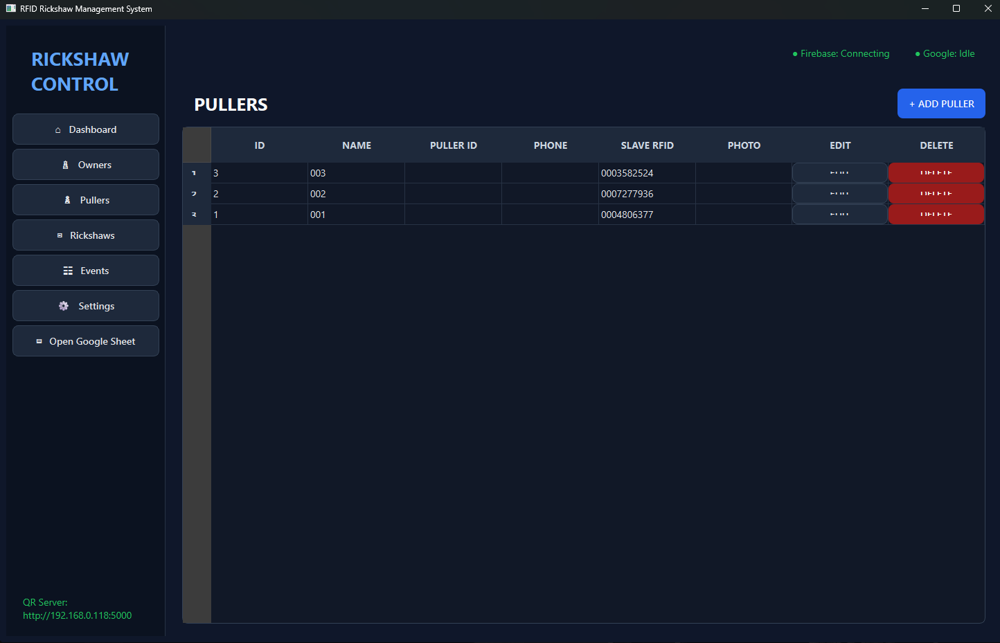 | 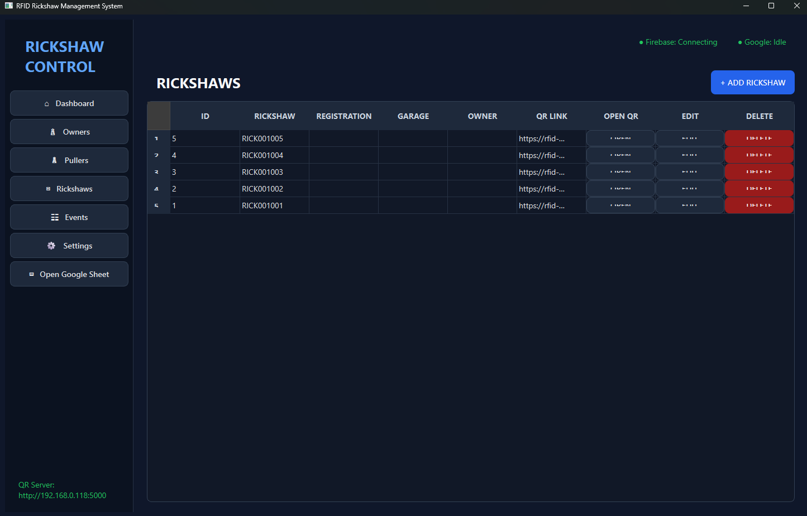 |
| Puller list with slave RFID and photo | Rickshaw list with generated QR link per vehicle |

| Event history | Settings |
|---|---|
| 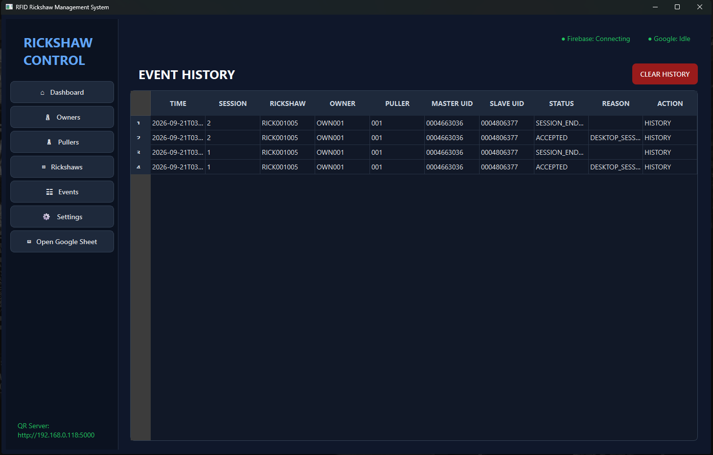 | 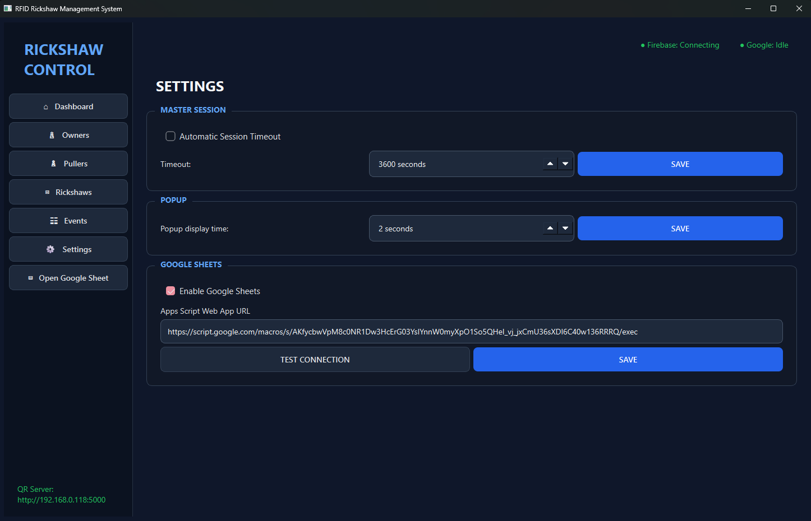 |
| Every accepted / rejected scan with reason codes | Session timeout, popup duration, Google Sheets URL |

### 📱 Mobile App (Flutter — Owner)

| Login | Owner dashboard | Session start / end |
|---|---|---|
| 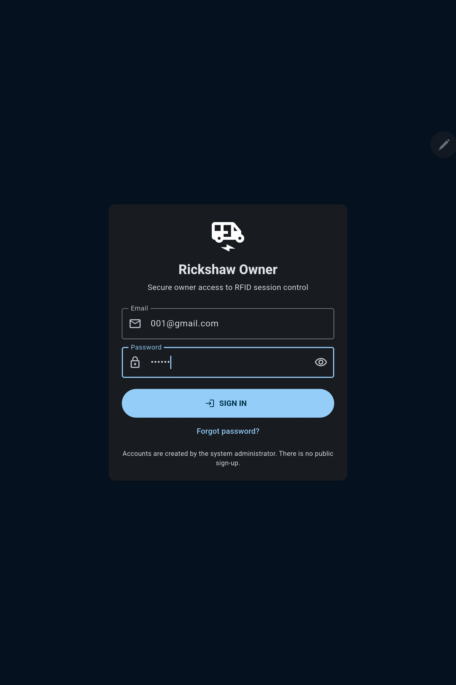 | 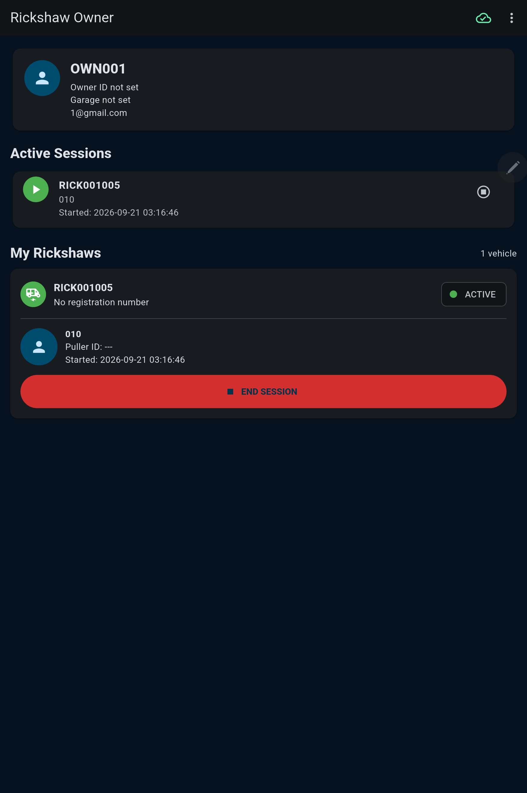 | 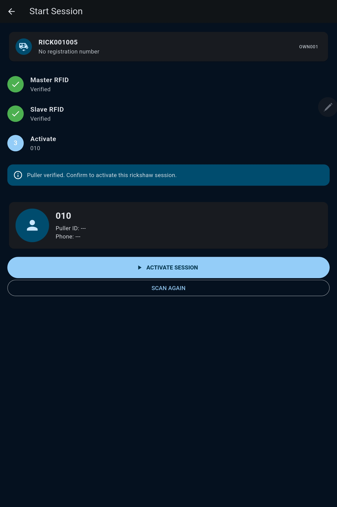 |

### 🌐 Public QR Page

| QR sticker on the rickshaw | Active — puller assigned | Idle — inside garage |
|---|---|---|
| 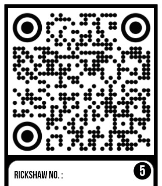 | 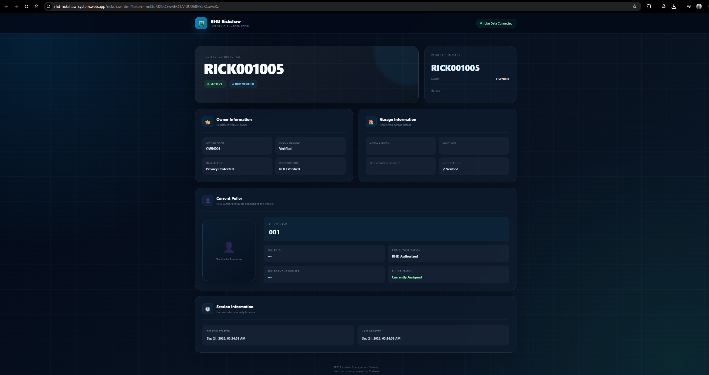 | 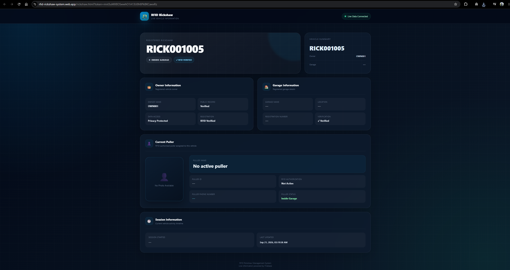 |

### 🔧 Hardware in action

| RFID reader + cards | Full setup |
|---|---|
| 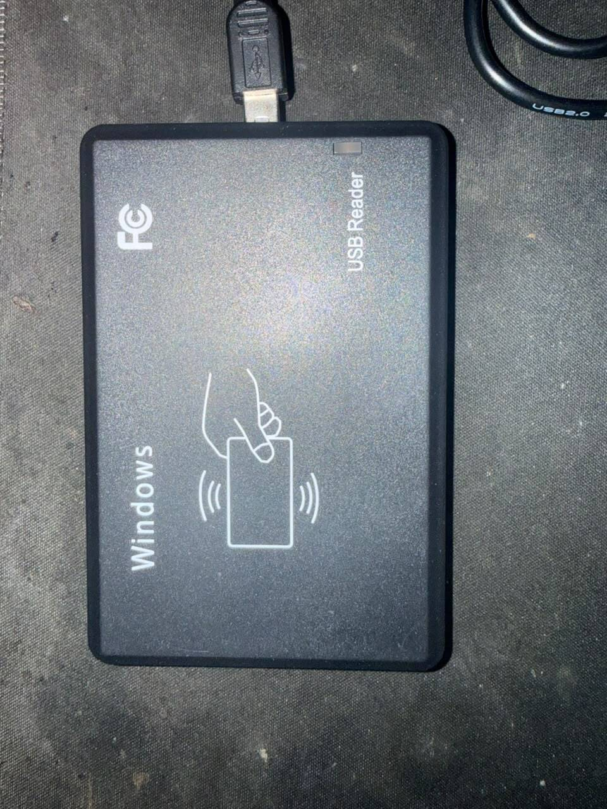 | 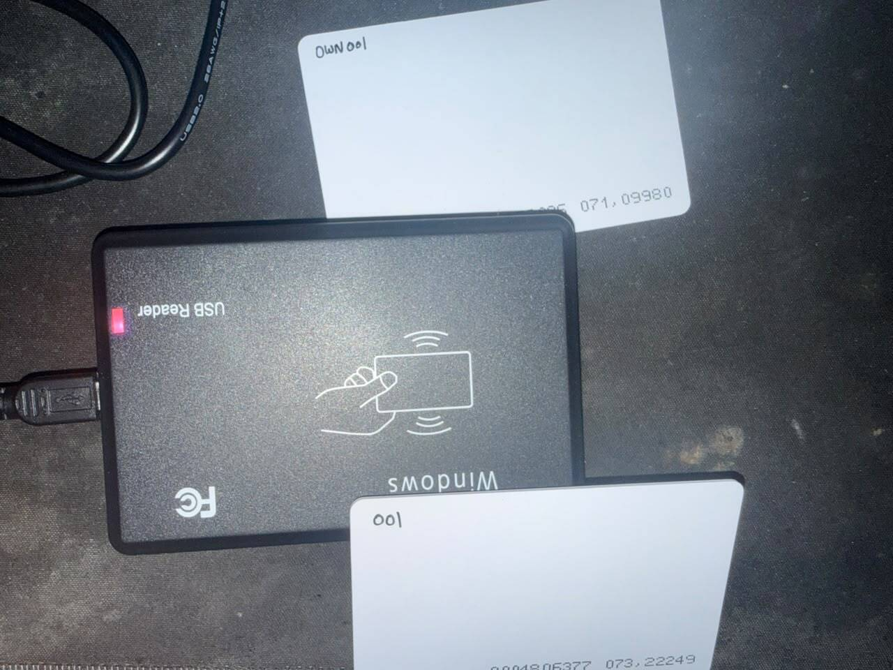 |

<details>
<summary><b>How to add screenshots</b></summary>

```bash
mkdir -p docs/screenshots
# drop your PNG/JPG files in with these exact names:
#   desktop-dashboard.png   desktop-owners.png    desktop-pullers.png
#   desktop-rickshaws.png   desktop-events.png    desktop-settings.png
#   mobile-login.png        mobile-dashboard.png  mobile-session.png
#   qr-sticker.jpg          public-active.png     public-idle.png
#   hardware-reader.jpg     hardware-setup.jpg
git add docs/screenshots && git commit -m "docs: add UI screenshots"
```

Keep each image under ~500 KB so the README loads fast. For a short demo clip, record a GIF and add it at the top of this section.

</details>

---

## 🧩 Components

### 🖥️ Desktop App — `main.py` (PySide6)

The admin and garage terminal. This is where all master data is entered.

- **Dashboard** — a focused RFID input that reads keyboard-wedge USB readers (auto-submits ~350 ms after the last character, or on Enter), live event cards per active session with countdown timers, and an END button per session.
- **Owners** — add / edit / delete owners, assign the **master RFID UID**, garage name and location, and open the **Mobile App Login** dialog to create or update that owner's Firebase Authentication account, change the password, or disable access. Passwords go straight to Firebase Auth and are never written to SQLite or the database.
- **Pullers** — add / edit / delete pullers, assign the **slave RFID UID**, and attach a photo (copied into the app data folder, then auto-resized to 640×640 JPEG and stored as a Base64 data URL).
- **Rickshaws** — add / edit / delete rickshaws, assign an owner, and get a **per-rickshaw QR link** (`…/rickshaw.html?token=<qr_token>`) ready to print.
- **Events** — full scan history: time, session, rickshaw, owner, puller, master UID, slave UID, status and reason code (`MASTER_REQUIRED`, `UNKNOWN_SLAVE`, `DESKTOP_SESSION_STARTED_LOCAL`, …).
- **Settings** — automatic session timeout (on/off + seconds), popup display duration, Google Apps Script web-app URL with a **Test Connection** button.
- **Status bar** — live `● Firebase: Connected / Connecting / Not Connected` and `● Google: Synced / Uploading / Failed` indicators.
- Runs the Flask QR server in a background thread on port **5000** and shows the LAN address in the sidebar.

### ☁️ Cloud Layer — `firebase_service.py`

Everything that touches Firebase, isolated in one module: master-data sync, atomic session start/end, the live listener, photo encoding, owner mobile-account management, and connectivity probes. See [Engineering notes](#-engineering-notes) for the reliability design.

### 🌐 Public QR Server — `qr_server.py` (Flask)

Serves the public rickshaw page and its JSON API:

| Route | Purpose |
|-------|---------|
| `GET /r/<token>` | Public rickshaw page |
| `GET /rickshaw.html?token=…` | Same page, matching the hosted URL shape |
| `GET /api/r/<token>` | Live JSON record (polled every 2 s by the page) |
| `GET /` | Health page |

It reads `public/by_token/<token>` from Firebase first and **falls back to local SQLite** if the cloud is unreachable — so a garage with a dead internet link still serves the page over LAN.

### 📱 Mobile App — Flutter (Rickshaw Owner)

- Firebase Auth email/password login, gated by `mobile_access/{uid}.active` (the desktop switches this on and off).
- The owner sees only their own rickshaws — enforced by the `access/owner_rickshaws` projection in the security rules, not just by UI filtering.
- Start and end sessions from the phone; the desktop picks the change up through its live listener.
- Offline persistence enabled (20 MB cache), so the app stays usable on weak mobile networks.
- Pushes session events to a **Google Apps Script → Google Sheet** log, with the script URL delivered live from `settings/google_sheet/api_url` (the desktop sets it; the phone receives it automatically — no rebuild needed).

---

## 🗄 Firebase data model

```
rfid-rickshaw-system-default-rtdb
│
├── master/                      # full records — desktop writes, admin-only reads
│   ├── owners/{id}              # name, owner_code, phone, garage, master_uid, active
│   ├── pullers/{id}             # name, puller_code, phone, slave_uid, photo (base64), active
│   └── rickshaws/{id}           # number, registration, garage, owner, qr_token, active
│
├── mobile/                      # slimmed projections the phone is allowed to read
│   ├── owners/{id}              # + mobile_email, mobile_login_enabled
│   └── pullers/{id}             # + photo
│
├── indexes/                     # O(1) RFID lookup (UID → record id)
│   ├── master_cards/{key}       # key = urlsafe-base64(UID)
│   └── slave_cards/{key}
│
├── access/                      # booleans only — never read by clients, used by rules
│   ├── owner_rickshaws/{ownerId}/{rickshawId}: true
│   └── owner_tokens/{ownerId}/{qrToken}: true
│
├── live/
│   ├── active_sessions/{rickshawId}   # 🔒 the one-session-per-rickshaw lock
│   └── rickshaws/{rickshawId}         # current status + puller projection
│
├── public/
│   └── by_token/{qrToken}       # 🌍 the only publicly readable node — what the QR page shows
│
├── history/
│   └── sessions/{cloudSessionId}      # ACTIVE / COMPLETED / SUPERSEDED, with ended_by + reason
│
├── mobile_access/{firebaseUid}  # owner ↔ login mapping + active flag (login gate)
│
└── settings/
    └── google_sheet/api_url     # Apps Script URL pushed live to the mobile app
```

**Why the `access/` and `public/` split matters:** the public page only ever reads `public/by_token/<token>`, which contains no phone numbers of owners, no RFID UIDs and no master data. The owner's phone can only write to rickshaws listed under its own `access/owner_rickshaws` entry. Neither can browse the master tree.

---

## 📂 Repository structure

```
rfid-rickshaw-system/
│
├── desktop/                          # 🖥️ PySide6 admin application
│   ├── main.py                       # UI, RFID workflow, session lifecycle, styling
│   ├── database.py                   # SQLite layer (owners, pullers, rickshaws, sessions, transactions)
│   ├── firebase_service.py           # all Firebase RTDB + Auth operations
│   ├── qr_server.py                  # Flask public QR page + JSON API
│   ├── requirements.txt
│   └── credentials/
│       └── firebase-adminsdk.json    # ⛔ service account — NEVER commit
│
├── mobile/                           # 📱 Flutter owner app
│   └── lib/
│       ├── main.dart                 # bootstrap, offline persistence, Sheet listener
│       ├── app.dart                  # theme + auth-state routing
│       ├── firebase_options.dart     # ⛔ generated by FlutterFire — see Security
│       ├── screens/
│       │   ├── login_screen.dart
│       │   └── dashboard_screen.dart
│       └── services/
│           ├── auth_service.dart
│           ├── rtdb_service.dart
│           └── google_sheet_service.dart
│
├── web/                              # 🌐 Firebase Hosting
│   └── rickshaw.html                 # public page served at /rickshaw.html?token=…
│
├── docs/
│   └── screenshots/                  # 📸 README images
│
├── database.rules.json               # Realtime Database security rules
└── README.md
```

> If your working copy is currently flat (all `.py` files in one folder), either keep it flat and simplify the paths above, or move them into `desktop/` — the imports are all relative to each other, so nothing breaks as long as the four Python files stay side by side.

---

## 🚀 Getting started

### Prerequisites

| Requirement | Notes |
|---|---|
| Python **3.10+** | Desktop app |
| Flutter **3.x** + Android SDK | Mobile app |
| A **Firebase project** | Realtime Database (asia-southeast1 or your region) + Authentication (Email/Password) |
| A **USB RFID reader** | Any keyboard-wedge 125 kHz / 13.56 MHz reader that types the UID and presses Enter |
| RFID cards/tags | One **master** per owner, one **slave** per puller |

---

### 1️⃣ Firebase setup

1. Create a Firebase project and enable **Realtime Database** and **Authentication → Email/Password**.
2. **Project settings → Service accounts → Generate new private key.** Save it as `desktop/credentials/firebase-adminsdk.json`.
3. Set `DATABASE_URL` in `firebase_service.py` to your own database URL.
4. Publish security rules that lock the tree down. Minimum shape:

```json
{
  "rules": {
    "public": {
      "by_token": { "$token": { ".read": true, ".write": false } }
    },
    "master":  { ".read": false, ".write": false },
    "indexes": { ".read": false, ".write": false },
    "access":  { ".read": false, ".write": false },
    "mobile": {
      "$section": {
        "$id": { ".read": "auth != null" }
      }
    },
    "mobile_access": {
      "$uid": { ".read": "auth != null && auth.uid === $uid" }
    },
    "live": {
      "active_sessions": {
        "$rickshawId": {
          ".read": "auth != null",
          ".write": "auth != null && root.child('mobile_access').child(auth.uid).child('active').val() === true && root.child('access/owner_rickshaws').child(root.child('mobile_access').child(auth.uid).child('owner_id_key').val()).child($rickshawId).val() === true"
        }
      },
      "rickshaws": { "$rickshawId": { ".read": "auth != null" } }
    },
    "settings": { ".read": "auth != null" }
  }
}
```

> The Admin SDK on the desktop bypasses these rules entirely — they exist to constrain the **mobile app** and the **public page**. Tighten them to match your deployment before going live.

---

### 2️⃣ Desktop app

```bash
cd desktop
python -m venv .venv
# Windows
.venv\Scripts\activate
# macOS / Linux
source .venv/bin/activate

pip install -r requirements.txt
python main.py
```

**`requirements.txt`**

```
PySide6
firebase-admin
Pillow
flask
requests
```

On first run the app creates its data folder:

```
Windows: %LOCALAPPDATA%\RFID_Rickshaw_System\
         ├── settings.json
         ├── photos/pullers/
         └── (SQLite database)
```

**First-run checklist**

1. **Settings → Test Connection** to confirm Firebase and Google Sheets are reachable.
2. **Owners → + ADD OWNER** — scan the master card straight into the *Master RFID* field.
3. **Pullers → + ADD PULLER** — scan the slave card, attach a photo.
4. **Rickshaws → + ADD RICKSHAW** — assign the owner. A `qr_token` and QR link are generated.
5. Print the QR link for each rickshaw and stick it on the vehicle.
6. Back on the **Dashboard**, scan master → pick rickshaw → scan slave. The public page goes live within a second.

**Building a Windows `.exe`**

```bash
pip install pyinstaller
pyinstaller --noconfirm --windowed --name "RFID Rickshaw System" ^
  --add-data "credentials;credentials" ^
  main.py
```

`firebase_service.py` already handles the PyInstaller `sys._MEIPASS` path, so bundled credentials resolve correctly in the frozen build.

---

### 3️⃣ Mobile app

```bash
cd mobile
flutter pub get

# generate firebase_options.dart for YOUR project
dart pub global activate flutterfire_cli
flutterfire configure

flutter run              # debug
flutter build apk --release
```

Then create the owner's login from the desktop: **Owners → select owner → MOBILE APP LOGIN → enter email + password → CREATE / UPDATE LOGIN.** That single action creates the Firebase Auth user, writes `mobile_access/{uid}`, and enables the account. **DISABLE ACCESS** revokes it immediately and kills existing refresh tokens.

---

### 4️⃣ Public QR page

**Hosted (recommended)** — deploy `web/rickshaw.html` to Firebase Hosting so the page works from anywhere, even with the garage PC switched off:

```bash
firebase deploy --only hosting
```

QR links then point at:

```
https://rfid-rickshaw-system.web.app/rickshaw.html?token=<qr_token>
```

Update `QR_BASE_URL` in `main.py` to match your hosting domain.

**LAN fallback** — the Flask server started by the desktop app serves the same page at `http://<pc-ip>:5000/rickshaw.html?token=…` (the address is shown in the app sidebar) and reads from local SQLite when the cloud is unreachable.

---

## 🔧 Configuration

| Setting | Where | Default |
|---|---|---|
| Session timeout | Settings page → `settings.json` | 3600 s (toggleable / unlimited) |
| Popup display time | Settings page → `settings.json` | 2 s |
| Google Apps Script URL | Settings page → also pushed to `settings/google_sheet/api_url` | project default |
| QR base URL | `QR_BASE_URL` in `main.py` | `https://rfid-rickshaw-system.web.app/rickshaw.html?token=` |
| Database URL | `DATABASE_URL` in `firebase_service.py` | project RTDB |
| Firebase HTTP timeout | `FIREBASE_HTTP_TIMEOUT` in `firebase_service.py` | 20 s |
| QR server port | `qr_server.run_server()` | 5000 |
| Photo size / quality | `photo_to_base64()` | 640×640, JPEG q76 |

---

## 🔐 Security

**Never commit these files.** Add to `.gitignore` *before* your first push:

```gitignore
# Firebase secrets
credentials/
*firebase-adminsdk*.json
google-services.json
GoogleService-Info.plist
lib/firebase_options.dart

# Local data
*.db
*.sqlite3
settings.json
photos/

# Python
__pycache__/
*.py[cod]
.venv/
build/
dist/
*.spec

# Flutter
.dart_tool/
.flutter-plugins*
build/
```

> ⚠️ **If you have already pushed a service-account key or committed one in an earlier commit, rotate it.** Go to *Firebase Console → Project settings → Service accounts*, delete the exposed key and generate a new one. Deleting the file in a later commit does **not** remove it from git history.

Design decisions already in place:

- Owner passwords are sent directly to Firebase Authentication — never stored in SQLite or the Realtime Database.
- Disabling an owner both disables the Auth user **and** revokes refresh tokens, so an already-signed-in phone loses access.
- Duplicate login mappings for one owner are automatically disabled, so exactly one credential stays authorized.
- Only `public/by_token/*` is world-readable, and it carries no RFID UIDs, no owner phone numbers and no master data.
- The Android API key in `firebase_options.dart` is a client identifier, not a secret — but your **security rules are** what actually protect the data. Review them before launch.

---

## 🛠 Engineering notes

Things in this codebase that exist because of real failures, not theory:

**Local-first sessions.** Scanning writes to SQLite and updates the UI *immediately*; the Firebase write is queued and retried on a 10-second timer. A slow or dead network never blocks the garage terminal.

**Atomic one-session-per-rickshaw claim.** `start_session()` uses an RTDB transaction on `live/active_sessions/{id}`. It distinguishes four cases: the same request retried (idempotent), the same owner+puller already committed after a timed-out response (adopted, not duplicated), a known-stale session this desktop already ended (replaced and archived as `SUPERSEDED`), and a genuine conflict from another device (raises `SessionConflictError`).

**Atomic end.** `end_session()` performs delete-active + write-history + set-IDLE + update-public in a **single multi-path update**, so the public page can never be stranded showing `ACTIVE` because a later write failed.

**Projection repair.** If the public page ever disagrees with `live/active_sessions`, `repair_active_projection()` rebuilds `live/rickshaws` and `public/by_token` from the authoritative session — and it runs automatically even on a conflict.

**Photos never block status.** The `ACTIVE` write is kept deliberately small and the Base64 photo is pushed in a second, best-effort update. A 2 MB photo on a weak link can't delay or break a session start.

**Photo normalization.** Every photo — including old oversized Base64 values already in the database — is EXIF-rotated, flattened onto white if transparent, resized to 640×640 and re-encoded as JPEG q76 before upload.

**GUI thread discipline.** All Firebase network work runs on daemon threads; results cross back to Qt through signals (`firebase_sessions_changed`, `session_start_finished`, `session_end_finished`). A `master_sync_lock` prevents overlapping full syncs from piling up during rapid edits.

**Failed reads are not empty state.** `get_active_sessions()` returns `None` on network failure and `{}` only on a genuinely empty read — so a dropped connection can never be mistaken for "no sessions" and silently close live assignments.

**Timestamp tolerance.** Desktop and mobile write ISO timestamps differently (naive vs. offset-aware), so session matching tolerates a ±3 s difference instead of demanding a byte-identical string.

---

## 🧯 Troubleshooting

| Symptom | Cause / fix |
|---|---|
| `[FIREBASE] Credentials not found` | `credentials/firebase-adminsdk.json` is missing or in the wrong folder. |
| Status bar stuck on **Not Connected** | Run **Settings → Test Connection**. Check `DATABASE_URL` and that the service account belongs to the same project. |
| QR page says **Rickshaw not found** | That rickshaw has no `qr_token` yet — re-save it on the Rickshaws page to trigger a master sync. |
| Public page stays **INSIDE GARAGE** after a scan | The projection write failed. It self-repairs on the next sync; `repair_active_projection()` also runs on conflict. |
| **"This rickshaw already has an active session"** | Another device holds it. End it there, or from the mobile app. |
| Owner can't log in on the phone | Mobile access disabled, or `mobile_access/{uid}.active` is false. Re-enable in **MOBILE APP LOGIN**. |
| **BROKEN LINK** in the mobile login dialog | The RTDB mapping exists but the Auth user was deleted. Press **CREATE / UPDATE LOGIN** to repair it. |
| RFID scans split across fields | The reader must be in keyboard-wedge mode and the Dashboard input must have focus. |
| Photos slow to appear on the QR page | Expected — the photo is pushed after the `ACTIVE` state on purpose. |

---

## 🗺 Roadmap

- [ ] Fare / trip logging per session
- [ ] Owner-side analytics (hours per puller, per rickshaw utilization)
- [ ] Bangla (বাংলা) localization for the public page
- [ ] Puller mobile app with session history
- [ ] Offline RFID queue on a standalone ESP32/Arduino reader
- [ ] Traffic-authority dashboard across multiple garages

---

## 🤝 Contributing

Issues and pull requests are welcome. For a substantial change, please open an issue first so we can discuss the approach.

---

## 📄 License

Released under the MIT License. See [`LICENSE`](LICENSE).

---

## 👤 Author

**\<Md. Mahin Rahman\>** — [@\<thisisdibbo\>](https://github.com/<thisisdibbo>)
[mr.d2003feb@gmail.com](mailto:mr.d2003feb@gmail.com)

Built as a full-stack IoT + cloud project: RFID hardware, desktop administration, mobile app, realtime database and a public verification page.

<p align="center"><i>⭐ If this project is useful to you, consider starring the repository.</i></p>
