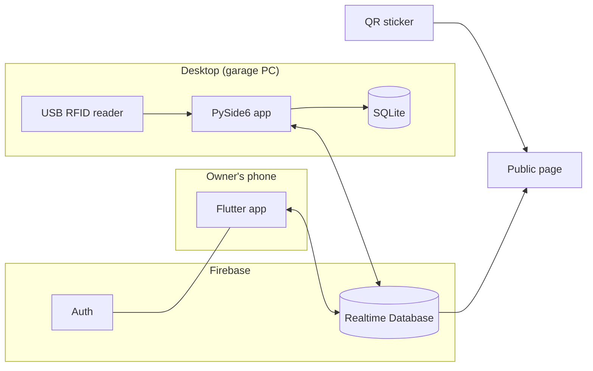

# RFID Rickshaw System

Answers one question: **who is pulling this rickshaw right now?**

Every rickshaw carries a QR sticker. Scan it and you see the puller currently assigned to it — his photo, his ID, the owner and the garage. The assignment itself is made with two RFID cards: the owner taps his, the puller taps his, and the pairing goes live on the public page within a second.

I built this because owners here rent the same rickshaw to a different puller most days, and nobody — not the passenger, not the garage, not the police — has any way to check who is actually on it.

---

## How an assignment is made

Each owner holds one **master** card. Each puller holds one **slave** card.

1. Owner taps his master card on the reader at the garage PC
2. A list of his rickshaws comes up — he picks one
3. The puller taps his slave card
4. That rickshaw is now **ACTIVE** with that puller, on the desktop, on the owner's phone, and on the public QR page

To end it: press END on the desktop, end it from the phone, or let the timeout expire (default one hour, configurable, or off).

If someone taps a slave card first, it's rejected with `MASTER_REQUIRED`. Unregistered cards are rejected outright. Every scan — accepted or not — goes into the event log with a reason code.

A rickshaw can only have one active session at a time. That's enforced with an atomic transaction on `live/active_sessions/{rickshawId}` in Firebase, so if a phone and the PC both try to claim the same rickshaw, exactly one wins and the other gets a conflict error instead of a corrupted state.

---

## The three parts



**Desktop app** (`main.py`, PySide6) — where all data is entered: owners and their master cards, pullers with slave cards and photos, rickshaws and their owners. Also the scanning terminal, the live session dashboard, the event history, and the settings. It runs a small Flask server on port 5000 as a LAN fallback for the QR page.

**Mobile app** (Flutter) — for owners. Email/password login through Firebase Auth, created and revoked from the desktop. An owner sees only his own rickshaws and can start or end sessions from the phone. It also pushes session events to a Google Sheet through an Apps Script endpoint.

**Public page** (`web/rickshaw.html`) — what the QR code opens. No login. It reads one node, `public/by_token/<token>`, which holds nothing but the rickshaw's identity and the current puller. Refreshes every two seconds.

---

## Screenshots

| Desktop dashboard | Owners |
|---|---|
|  |  |

| Rickshaws with QR links | Event history |
|---|---|
|  |  |

| Owner app | Public page — assigned | Public page — idle |
|---|---|---|
|  |  |  |


---

## Firebase layout

```
master/          owners, pullers, rickshaws — full records, desktop writes these
mobile/          trimmed copies the phone is allowed to read
indexes/         RFID UID → record id, so a card lookup is one read
access/          booleans the security rules use to decide what an owner may touch
live/
  active_sessions/{rickshawId}    the one-session-per-rickshaw lock
  rickshaws/{rickshawId}          current status
public/
  by_token/{qrToken}              the only node the world can read
history/
  sessions/{cloudSessionId}       every session, with who ended it and why
mobile_access/{uid}               owner ↔ login mapping and the enable/disable flag
settings/google_sheet/api_url     Apps Script URL, pushed live to the phone
```

The split matters. The public node carries no RFID UIDs, no owner phone numbers, no master data. An owner's phone can only write to rickshaws listed under his own `access/owner_rickshaws` entry — that's checked by the rules, not just hidden in the UI.

---

## Running it

You need Python 3.10+, Flutter 3.x with the Android SDK, a Firebase project with Realtime Database and Email/Password auth turned on, a keyboard-wedge USB RFID reader, and cards.

### Desktop

```bash
pip install PySide6 firebase-admin Pillow flask requests
python main.py
```

Put your Firebase service-account JSON at `credentials/firebase-adminsdk.json` first, and set `DATABASE_URL` in `firebase_service.py` to your own database. Without it the app starts but prints `[FIREBASE] Credentials not found` and runs local-only.

On first run it creates `%LOCALAPPDATA%\RFID_Rickshaw_System\` for settings, the database and puller photos.

Then: add an owner (scan the master card straight into the field), add a puller with his slave card and a photo, add a rickshaw and assign the owner. A QR token is generated per rickshaw — the Rickshaws page gives you the link to print.

### Mobile

```bash
cd mobile
flutter pub get
flutterfire configure     # generates firebase_options.dart for your project
flutter run
```

Create the owner's login from the desktop: Owners → select owner → MOBILE APP LOGIN → email and password → CREATE / UPDATE LOGIN. That makes the Auth user, writes the access mapping and enables it in one step. DISABLE ACCESS revokes it immediately and kills existing tokens.

### Public page

Deploy `web/` to Firebase Hosting so the page works with the garage PC switched off:

```bash
firebase deploy --only hosting
```

Then point `QR_BASE_URL` in `main.py` at your domain. Without hosting, the Flask server inside the desktop app serves the same page at `http://<pc-ip>:5000/rickshaw.html?token=…` over the LAN — the address is shown in the app sidebar.

---

## Settings

Session timeout (on/off and seconds), popup display time, and the Google Apps Script URL are all in the Settings page and saved to `settings.json`. The QR base URL, database URL, Firebase HTTP timeout and photo size are constants in `main.py` and `firebase_service.py`.

---

## A few design notes

Things in here that exist because something broke, not because they were planned:

**Sessions are written locally first.** A scan hits SQLite and updates the UI immediately; the Firebase write is queued and retried every ten seconds. On a bad connection the garage terminal stays usable instead of freezing on a network call.

**Ending a session is one multi-path update.** Delete the active row, write history, set the rickshaw IDLE and update the public node all commit together. Earlier versions did these as separate writes and the public page could get stranded showing ACTIVE when the rickshaw was already back in the garage.

**Photos are pushed after the ACTIVE state, not with it.** The session-start write is kept small on purpose. A 2 MB photo on a weak link used to delay or break the whole thing.

**A failed read is not an empty read.** `get_active_sessions()` returns `None` when the network fails and `{}` only when Firebase genuinely has no sessions. Treating those the same once closed live sessions during an outage.

**Timestamps are compared with a tolerance.** The desktop writes naive ISO times, the phone writes offset-aware ones. Matching them byte-for-byte produced false conflicts, so session identity allows a few seconds of difference.

All Firebase work runs on daemon threads and comes back to Qt through signals. Nothing network-bound touches the GUI thread.

---

## Not done yet

- No fare or trip logging — the system records who and when, not how much
- The mobile app has no session history screen
- Google Sheets logging happens on the phone only; the desktop doesn't write to the sheet
- The public page polls every two seconds instead of using a realtime listener
- Only Android is configured in `firebase_options.dart` — iOS, web and desktop targets throw
- The desktop app assumes Windows (`%LOCALAPPDATA%` for its data folder)
- Puller photos are stored as base64 in the Realtime Database rather than Cloud Storage. It works because they're resized to 640×640 first, but it isn't the right place for them

---

## Security

`credentials/firebase-adminsdk.json` is a service-account key with full access to the database. It's gitignored and must stay that way. If it ever lands in a commit, rotate it in the Firebase console and delete the old key in Google Cloud — deleting the file in a later commit doesn't remove it from history.

Owner passwords go straight to Firebase Auth and are never written to SQLite or the database. Disabling an owner disables the Auth user *and* revokes refresh tokens, so a phone that's already signed in loses access.

The API key in `firebase_options.dart` and in the web page is a client identifier, not a secret — it ships in every browser by design. The security rules are what actually protect the data.

---

## Troubleshooting

**`[FIREBASE] Credentials not found`** — the service-account JSON isn't at `credentials/firebase-adminsdk.json`.

**Status bar says Not Connected** — Settings → Test Connection. Usually the wrong `DATABASE_URL`, or a service account from a different project.

**QR page says "Rickshaw not found"** — that rickshaw has no `qr_token` yet. Re-save it on the Rickshaws page to trigger a sync.

**"This rickshaw already has an active session"** — another device holds it. End it there first.

**Owner can't log in** — mobile access is disabled. Re-enable it in MOBILE APP LOGIN. If the dialog says BROKEN LINK, the database mapping survived but the Auth user was deleted; pressing CREATE / UPDATE LOGIN repairs it.

**Scans arrive split across fields** — the reader isn't in keyboard-wedge mode, or the Dashboard input doesn't have focus.

---

## License

MIT — see [LICENSE](LICENSE).

**DIBBO** — [@thisisdibbo](https://github.com/thisisdibbo)
